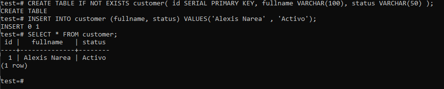

# TAS3 - Volumenes
## 1. Titulo
Persistencia de Base de Datos con Docker y Volumenes en PostgesSQL
## 2. Tiempo de duración
El tiempo fue de 160 minutos. 
## 3. Fundamentos:

## Contenedor Docker 

Un contenedor de Docker es un entorno de ejecución que tiene todos los componentes necesarios (como el código, las dependencias y las bibliotecas) para ejecutar el código de la aplicación sin utilizar las dependencias de la máquina host. Este tiempo de ejecución del contenedor se ejecuta en el motor de un servidor, una máquina o una instancia en la nube. El motor ejecuta varios contenedores en función de los recursos subyacentes disponibles(Imagen de Docker y Contenedor: Diferencia Entre Tecnologías de Implementación de Aplicaciones - AWS, n.d.). 

- Estándar: Docker creó el estándar de la industria para contenedores, para que pudieran ser portátiles en cualquier lugar
- Ligero: los contenedores comparten el núcleo del sistema operativo de la máquina y, por lo tanto, no requieren un sistema operativo por aplicación, lo que impulsa una mayor eficiencia del servidor y reduce los costos de servidor y licencias.
- Seguro: las aplicaciones son más seguras en contenedores y Docker proporciona las capacidades de aislamiento predeterminadas más sólidas de la industria.

## Imagen Docker 

Una imagen de Docker, o una imagen de contenedor, es un archivo ejecutable e independiente que se utiliza para crear un contenedor. Esta imagen de contenedor contiene las bibliotecas, las dependencias y los archivos que el contenedor necesita para ejecutarse. Una imagen de Docker se puede compartir y transportar; por lo tanto, se puede implementar la misma imagen en varias ubicaciones a la vez, como un archivo binario de software.Puede almacenar imágenes en registros para realizar un seguimiento de arquitecturas de software complejas, proyectos, segmentos de negocio y accesos a grupos de usuarios. Por ejemplo, el registro público Docker Hub contiene imágenes como sistemas operativos, marcos de lenguajes de programación, bases de datos y editores de código(Imagen de Docker y Contenedor: Diferencia Entre Tecnologías de Implementación de Aplicaciones - AWS, n.d.). 

## 4. Conocimientos previos.
   
Para realizar esta practica el estudiante necesita tener claro los siguientes temas:
- Comandos básicos de Docker.
- Conocimientos basicos de PostgreSQL.
- Uso de administradores de baso de datos.

## 5. Objetivos a alcanzar

- Comprobar la pérdida de datos al eliminar un contenedor sin volumen.
- Crear y utilizar volúmenes persistentes en contenedores PostgreSQL.
- Verificar la persistencia de datos después de eliminar el contenedor.
  
## 6. Equipo necesario:
  
- Computador.
- Docker funcionando.
- Administrador de base de datos(TablePlus, DBeaver, etc).

## 7. Material de apoyo.
   
- Documentación de Docker.
- Documentación de PostgreSQL.
- Guía de asignatura.
- Cheat Sheet de comandos Docker. 
- Videos tutoriales de Docker y PostgreSQL.
  
## 8. Procedimiento

### Pasos 

**Parte 1: Base de datos sin  volumen**

1. Crear un contenedor PostgreSQL con el nombre server_db1.

Figura 8-1 Creación de contenedor server_db1.

2. Crear una base de datos llamada test.

Figura 8-2 Creacion de la base de datos con el nombre test.

3. En la base de datos test, crear una tabla llamada customer con los campos: id, fullname y status.
4. Insertar al menos un registro en la tabla customer.

Figura 8-3 Creacion de la tabla customer con sus campos.

5. Detener y eliminar el contenedor server_db1.
   
Figura 8-4 Eliminacion del contenedor server_db1.

6. Volver a crear el contenedor PostgreSQL con el mismo nombre server_db1.
7. Verificar que la base de datos test ya no existe, demostrando que los datos no se han conservado.

Figura 8-5 Creacion de otro contenedor con el mismo nombre.

**Parte 2: Base de datos con volumen**

8. Crear un volumen en Docker.
9. Crear un contenedor PostgreSQL con el nombre server_db2, asociando el volumen creado.

Figura 8-6 Creacion del volumen y contenedor.

10. Crear la base de datos test.

Figura 8-7 Creacion de la base de datos test.

11. Crear la tabla customer con los campos: id, fullname, status.
12. Insertar al menos un registro en la tabla.

Figura 8-8 Creacion de la tabla customer y sus campos.

13. Detener y eliminar el contenedor server_db2.

Figura 8-9 Eliminacion del contenedor server_db2.

14. Volver a crear el contenedor server_db2 usando el volumen pgdata nuevamente.
15. Conectarse desde el administrador de base de datos y verificar que la base de datos test y los registros han persistido

Figura 8-10 Verificacion de la base de datos y registros.

## 9. Resultados esperados:
    
Al finalizar la práctica, se logró cumplir exitosamente cada uno de los objetivos planteados en el procedimiento. En primer lugar, se realizó el despliegue correcto de los contenedores Docker ejecutando el servidor web Nginx, utilizando la imagen oficial disponible en Docker Hub. Cada contenedor fue vinculado a un puerto diferente (8089 y 8090), permitiendo el acceso independiente desde el navegador.

Cada servidor web mostró una página HTML distinta, cumpliendo con la guía. El primer contenedor desplegó una página con información institucional, mientras que el segundo mostró una página personalizada con datos del estudiante. Para lograr esto, se utilizaron comandos como docker ``cp`` para transferir los archivos HTML al interior de los contenedores.

Durante el proceso se emplearon de manera adecuada los comandos ``docker run``, ``docker cp``, ``docker stop``, ``docker start``. Además, se aplicó correctamente el mapeo de puertos con la opción ``-p``, y se trabajó en modo desatendido con ``-d`` para mantener los servicios corriendo en segundo plano.

Todo el desarrollo de la práctica fue documentado con capturas de pantalla que evidencian el funcionamiento de los servidores web, el uso correcto de los comandos Docker y la visualización del contenido personalizado desde el navegador. Esto demuestra una comprensión sólida de los conceptos de virtualización, contenedores y servicios web, alcanzando satisfactoriamente los objetivos de aprendizaje propuestos.

## 10. Bibliografía
    
- Imagen de Docker y contenedor: diferencia entre tecnologías de implementación de aplicaciones - AWS. (n.d.). Retrieved April 10, 2025, from https://aws.amazon.com/es/compare/the-difference-between-docker-images-and-containers/
- ¿Qué es un contenedor? | Docker. (n.d.). Retrieved April 10, 2025, from https://www.docker.com/resources/what-container/

