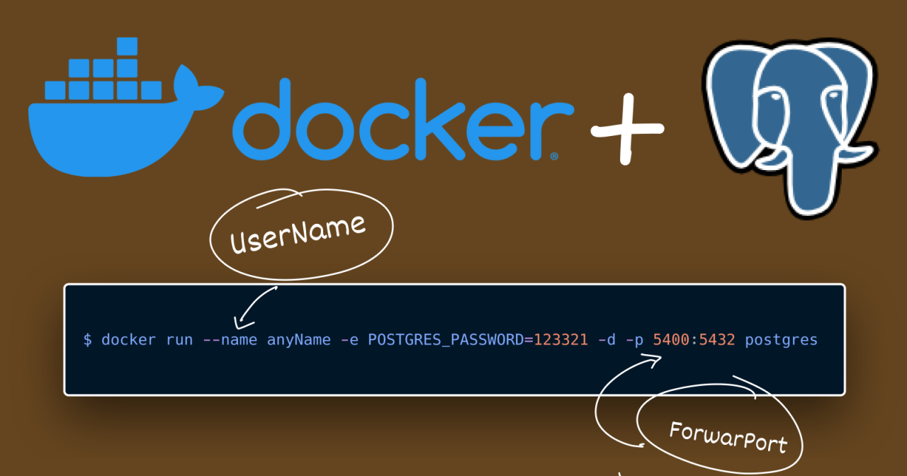

# TAS3 - Volumenes
## 1. Titulo
Persistencia de Base de Datos con Docker y Volumenes en PostgesSQL
## 2. Tiempo de duración
El tiempo fue de 160 minutos. 
## 3. Fundamentos:

## Volumenes Docker 

Los volúmenes son almacenes de datos persistentes para contenedores, creados y administrados por Docker. Puedes crear un volumen específicamente con el docker volume createcomando, o Docker puede crearlo durante la creación del contenedor o servicio. Al crear un volumen, este se almacena en un directorio del host de Docker. Al montarlo en un contenedor, este directorio es el que se monta en el contenedor. Esto es similar al funcionamiento de los montajes de enlace, salvo que Docker administra los volúmenes y los pasillos de la funcionalidad principal del host (Volúmenes | Documentación de Docker, n.d.).

## Cuando utilizar volumenes

Los volúmenes son el mecanismo preferido para la persistencia de los datos generados y utilizados por los contenedores Docker. Si bien los montajes de enlace dependen de la estructura de directorios y del sistema operativo del equipo host, Docker gestiona completamente los volúmenes. Los siguientes volúmenes son una buena opción para los casos de uso:

- Es más fácil realizar copias de seguridad o migrar volúmenes que montajes enlazados.
- Puede administrar volúmenes mediante los comandos CLI de Docker o la API de Docker.
- Los volúmenes funcionan tanto en contenedores Linux como Windows.
- Los volúmenes se pueden compartir de forma más segura entre varios contenedores.
- Los nuevos volúmenes pueden tener su contenido rellenado previamente por un contenedor o una compilación.
- Cuando su aplicación requiere E/S de alto rendimiento.

## Postgres

Postgres es una de las principales bases de datos relacionales multimodelo disponibles actualmente. Está diseñada para impulsar aplicaciones de bases de datos, que proporcionan datos importantes directamente a los usuarios finales o a través de otra aplicación mediante API. La estructura relacional de objetos y la concurrencia de Postgres son ventajas sobre alternativas como MySQL. Es altamente escalable y admite consultas SQL complejas basadas en estándares. La Imagen Oficial de Docker (DOI) de Postgres te permite crear un contenedor de Postgres adaptado específicamente a tu aplicación. Esta imagen también gestiona muchas tareas de configuración básicas (Cómo Usar La Imagen Oficial de Docker de Postgres | Docker, n.d.).

## 4. Conocimientos previos.
   
Para realizar esta practica el estudiante necesita tener claro los siguientes temas:
- Comandos básicos de Docker.
- Conocimientos basicos de PostgreSQL.
- Uso de administradores de baso de datos.

## 5. Objetivos a alcanzar

- Comprobar la pérdida de datos al eliminar un contenedor sin volumen.
- Crear y utilizar volúmenes persistentes en contenedores PostgreSQL.
- Verificar la persistencia de datos después de eliminar el contenedor.
  
## 6. Equipo necesario:
  
- Computador.
- Docker funcionando.
- Administrador de base de datos(TablePlus, DBeaver, etc).

## 7. Material de apoyo.
   
- Documentación de Docker.
- Documentación de PostgreSQL.
- Guía de asignatura.
- Cheat Sheet de comandos Docker. 
- Videos tutoriales de Docker y PostgreSQL.
  
## 8. Procedimiento

### Pasos 

**Parte 1: Base de datos sin  volumen**

1. Crear un contenedor PostgreSQL con el nombre server_db1.

Figura 8-1 Creación de contenedor server_db1.

2. Crear una base de datos llamada test.

Figura 8-2 Creacion de la base de datos con el nombre test.

3. En la base de datos test, crear una tabla llamada customer con los campos: id, fullname y status.
4. Insertar al menos un registro en la tabla customer.

Figura 8-3 Creacion de la tabla customer con sus campos.

5. Detener y eliminar el contenedor server_db1.
   
Figura 8-4 Eliminacion del contenedor server_db1.

6. Volver a crear el contenedor PostgreSQL con el mismo nombre server_db1.
7. Verificar que la base de datos test ya no existe, demostrando que los datos no se han conservado.

Figura 8-5 Creacion de otro contenedor con el mismo nombre.

**Parte 2: Base de datos con volumen**

8. Crear un volumen en Docker.
9. Crear un contenedor PostgreSQL con el nombre server_db2, asociando el volumen creado.

Figura 8-6 Creacion del volumen y contenedor.

10. Crear la base de datos test.

Figura 8-7 Creacion de la base de datos test.

11. Crear la tabla customer con los campos: id, fullname, status.
12. Insertar al menos un registro en la tabla.

Figura 8-8 Creacion de la tabla customer y sus campos.

13. Detener y eliminar el contenedor server_db2.

Figura 8-9 Eliminacion del contenedor server_db2.

14. Volver a crear el contenedor server_db2 usando el volumen pgdata nuevamente.
15. Conectarse desde el administrador de base de datos y verificar que la base de datos test y los registros han persistido

Figura 8-10 Verificacion de la base de datos y registros.

## 9. Resultados esperados:

Al finalizar la práctica, se logró cumplir exitosamente cada uno de los objetivos planteados en el procedimiento. En primer lugar, se realizó el despliegue correcto de los contenedores Docker ejecutando la base de datos PostgreSQL, utilizando la imagen de postgres. Se utilizaron dos enfoques: uno sin volumen y otro con volumen persistente. En la primera parte, se comprobó que los datos no se conservaron al eliminar el contenedor server_db1. Esto validó el comportamiento volátil del almacenamiento interno del contenedor.

En la segunda parte, se creó un volumen llamado pgdata y se asoció al contenedor server_db2. Luego de insertar datos en la base de datos test, se detuvo y eliminó el contenedor. Al recrearlo utilizando el mismo volumen, se verificó exitosamente que los datos persistieron, incluyendo la base de datos y los registros en la tabla customer. Durante el proceso se aplicaron de manera adecuada los comandos ``docker run``, ``docker volume create``, ``docker stop``, ``docker rm``.

Todo el desarrollo de la práctica fue documentado con capturas de pantalla que evidencian el comportamiento esperado de PostgreSQL con y sin volúmenes, el uso correcto de los comandos Docker. Demostrando una comprensión sólida de los conceptos de persistencia de datos, virtualización y manejo de contenedores Docker, alcanzando satisfactoriamente los objetivos de aprendizaje propuestos.
    

## 10. Bibliografía
    
- Cómo usar la imagen oficial de Docker de Postgres | Docker. (n.d.). Retrieved April 17, 2025, from https://www.docker.com/blog/how-to-use-the-postgres-docker-official-image/
  
- Volúmenes | Documentación de Docker. (n.d.). Retrieved April 17, 2025, from https://docs-docker-com.translate.goog/engine/storage/volumes/?_x_tr_sl=en&_x_tr_tl=es&_x_tr_hl=es&_x_tr_pto=tc

